# Report

**Lab Assignment (Fall 2024)**
*Cloud Computing - From Infrastructure to Applications Course, ENSIMAG, Grenoble INP*

***Authors: Alberto Pasqualetto, Matteo Ciccone***

*Repository: [albertopasqualetto/onlineboutique-cloud-assignment](https://github.com/albertopasqualetto/onlineboutique-cloud-assignment)*

Every command is to be run from the root of the repository.

## Deploying the original application in GKE

We created the cluster from GKE dashboard, choosing the standard configuration (zone, cluster name, node count, ...).

Then we cloned the repository and we connected to the cluster with `gcloud container clusters get-credentials onlineboutique`

Finally we deployed the application with `kubectl apply -f https://raw.githubusercontent.com/GoogleCloudPlatform/microservices-demo/refs/heads/main/release/kubernetes-manifests.yaml` retrieving it directly from the original repository.

We verified the deployment was succesful obtaining the ip address of the frontend's load balancer with `kubectl get services frontend-external` and reading the output of the load generator with `kubectl logs <LOADGENERATOR_POD_NAME>`.

### Autopilot mode

**Autopilot** is a GKE operation mode where Google manages the cluster configuration, including:

- Nodes
- Scaling
- Security

According to the [Autopilot vs Standard Feature Comparison](https://cloud.google.com/kubernetes-engine/docs/resources/autopilot-standard-feature-comparison):

- Autopilot **manages nodes**.
- Autopilot **automatically scales the number and size of nodes** based on Pods in the cluster.
- Autopilot uses a **general-purpose platform optimized for most workloads**.

This hides cluster configuration details from the user, addressing issues like low resource allocation often seen in GKE's standard mode.

## Analyzing the provided configuration

The `kubernetes-manifests.yaml` file defines configurations for all Online Boutique services. For each service, it includes:

- A **`Deployment`**
- One or more **`Service`** objects
- A **`ServiceAccount`**

### Frontend Service Example

Here is an the extract of the configuration regarding the **frontend service**:

```yaml
---
apiVersion: apps/v1
kind: Deployment
metadata:
  name: frontend
  labels:
    app: frontend
spec:
  selector:
    matchLabels:
      app: frontend
  template:
    metadata:
      labels:
        app: frontend
      annotations:
        sidecar.istio.io/rewriteAppHTTPProbers: "true"
    spec:
      serviceAccountName: frontend
      securityContext:
        fsGroup: 1000
        runAsGroup: 1000
        runAsNonRoot: true
        runAsUser: 1000
      containers:
      - name: server
        securityContext:
          allowPrivilegeEscalation: false
          capabilities:
            drop:
              - ALL
          privileged: false
          readOnlyRootFilesystem: true
        image: gcr.io/google-samples/microservices-demo/frontend:v0.10.1
        ports:
        - containerPort: 8080
        readinessProbe:
          initialDelaySeconds: 10
          httpGet:
            path: "/_healthz"
            port: 8080
            httpHeaders:
            - name: "Cookie"
              value: "shop_session-id=x-readiness-probe"
        livenessProbe:
          initialDelaySeconds: 10
          httpGet:
            path: "/_healthz"
            port: 8080
            httpHeaders:
            - name: "Cookie"
              value: "shop_session-id=x-liveness-probe"
        env:
        - name: PORT
          value: "8080"
        resources:
          requests:
            cpu: 100m
            memory: 64Mi
          limits:
            cpu: 200m
            memory: 128Mi
---
apiVersion: v1
kind: Service
metadata:
  name: frontend
  labels:
    app: frontend
spec:
  type: ClusterIP
  selector:
    app: frontend
  ports:
  - name: http
    port: 80
    targetPort: 8080
---
apiVersion: v1
kind: Service
metadata:
  name: frontend-external
  labels:
    app: frontend
spec:
  type: LoadBalancer
  selector:
    app: frontend
  ports:
  - name: http
    port: 80
    targetPort: 8080
---
apiVersion: v1
kind: ServiceAccount
metadata:
  name: frontend
---
```

#### Explanation of Key Fields

##### Common Fields

- **`apiVersion`**: The API version for the object.
- **`kind`**: The type of Kubernetes object (e.g., `Deployment`, `Service`, `ServiceAccount`).
- **`metadata`**: Contains the object's name and labels; in this piece of manifest all objects have "frontend" name except one service with "frontend-external" name and all objects have "app: frontend" label.

##### Deployment Specification (`spec`)

- **`selector.matchLabels.app: frontend`**: Matches pods managed by this deployment.
- **`template`**:
  - **`metadata`**:
    - **`labels.app: frontend`**: Labels the pods for this deployment, it is the name of the app.
    - **`annotations.sidecar.istio.io/rewriteAppHTTPProbers: "true"`**: Ensures a possible Istio instance (a sidecar software which provides observability, traffic management and security) to rewrite readiness and liveness probes to be redirected through it.
  - **`spec`**:
    - **`serviceAccountName: frontend`**: Associates the deployment with the `frontend` ServiceAccount.
    - **`securityContext`**: Configures security settings for the pod:
      - **`fsGroup`, `runAsGroup`, `runAsUser`**: Ensures non-root execution with specific user/group IDs.
      - **`runAsNonRoot: true`**: Enforces that the container runs as a non-root user.
    - **`containers`**: Defines the list of containers in the pod, "`server`" is the only one in this case.
      - **`securityContext`**: Hardens container security:
        - **`allowPrivilegeEscalation: false`**: Prevents privilege escalation.
        - **`capabilities.drop: [ALL]`**: Drops all POSIX [capabilities](https://man.archlinux.org/man/capabilities.7) (related to a fine-grained "superuser" permissions system).
        - **`privileged: false`**: Runs the container in a non-privileged mode.
        - **`readOnlyRootFilesystem: true`**: Makes the filesystem read-only (container is stateless).
      - **`image`**: Specifies the container image to use.
      - **`ports.containerPort: 8080`**: Exposes port 8080 inside the pod.
    - **`readinessProbe`**: Configures readiness checks, used to indicate when the pod is ready to serve traffic, the container will not receive requests while it is not ready.:
      - HTTP GET request (`httpGet`) to `/_healthz` (`path`) on port 8080 (`port`) with header `Cookie: shop_session-id=x-readiness-probe`.
    - **`livenessProbe`**: Configures liveness checks:
      - Similar to readiness checks but checks if the container is alive, otherwise it is restarted.
    - **`env`**: Defines environment variables for the container.
    - **`resources`**: Defines resource requests and limits:
      - CPU: `100m` (min), `200m` (max).
      - Memory: `64Mi` (min), `128Mi` (max).

##### Service Specifications (`spec`)

- **Frontend Service (`ClusterIP`)**:
  - **`type: ClusterIP`**: Exposes the service within the cluster.
  - **`selector.app: frontend`**: Routes traffic to pods with matching labels; in this case the previously defined deployment.
  - **`ports`**: Maps external port 80 to internal port 8080 with the name "http".

- **Frontend External Service (`LoadBalancer`)**:
  - **`type: LoadBalancer`**: Exposes the service externally with a public IP through a requested load balancer (GCP provides one automatically).
  - **`selector.app: frontend`**: Routes traffic to pods with matching labels; in this case the previously defined deployment.
  - **`ports`**: Maps external port 80 to internal port 8080 with the name "http".

##### ServiceAccount

A **`ServiceAccount`** represents a non-human Kubernetes user, providing a distinct identity for interactions, here it has no `spec` definition.

## Deploying the load generator on a local machine

We used the image of the load generator provided by the original repository (`us-central1-docker.pkg.dev/google-samples/microservices-demo/loadgenerator:v0.10.2`) and we ran it with the command `docker run -e FRONTEND_ADDR=<ADDRESS> -e USERS=10 <IMAGE ID>`, finally we analyzed the output recognising its correctness.

## Deploying Automatically the Load Generator in Google Cloud

### Step 1: Infrastructure Provisioning Using Terraform

First of all we collected boilerplate files from "[Running MPI applications](https://roparst.gricad-pages.univ-grenoble-alpes.fr/cloud-tutorials/mpi/)", including:

- `simple_deployment.tf`
- `variables.tf`
- `parse-tf-state.py`
- `setup.sh`

Then we simplified them delegating all the work to Terraform in `auto-deploy-loadgenerator/deployment.tf` and `auto-deploy-loadgenerator/variables.tf`:

- We are using an image with Docker Engine installed (`cos-cloud/cos-117-lts`).
- We prepare the inventory file for Ansible with a `local_file` resource:

  ```hcl
  resource "local_file" "hosts" {
      content = <<EOF
  %{ for i in range(var.machineCount) }
  ${google_compute_instance.vm_instance[i].network_interface.0.access_config.0.nat_ip}
  %{ endfor }

  [all:vars]
  ansible_ssh_user=${var.GCPUserID}
  ansible_ssh_private_key_file='${var.GCPPrivateSSHKeyFile}'
  ansible_ssh_common_args='-o StrictHostKeyChecking=no'
  EOF
      filename = "hosts"
  }
  ```

- `GCPUserID` and `GCPPrivateSSHKeyFile` are defined in `terraform.tfvars` of the root directory.

Finally we runned Terraform:

```bash
terraform -chdir=auto-deploy-loadgenerator init # Initialize Terraform
terraform -chdir="auto-deploy-loadgenerator" plan -var-file="../terraform.tfvars" # Plan Deployment
terraform -chdir="auto-deploy-loadgenerator" apply -var-file="../terraform.tfvars"  # Apply Deployment
```

`-var-file` is used to pass the variables from root folder to the Terraform configuration and do not duplicate the configuration.

From this point on, also the GKE cluster was created with Terraform in a similar way that can be seen in the `deployment.tf` file.

### Step 2: Automating Deployment with Ansible

We created a playbook named `run_docker_image.yml` to automate the deployment and execution of the Locust load generator docker image, it is really simple and uses the `docker_container` Ansible module (in a previous iteration we also built the Dockerfile, but it was not necessary).

Then using the `hosts` file generated by Terraform we runned the playbook: `ansible-playbook -i ./auto-deploy-loadgenerator/hosts ./auto-deploy-loadgenerator/run_docker_image.yml
       --extra-vars "frontend_external_ip=$(kubectl get svc istio-ingressgateway -n istio-system -o jsonpath='{.status.loadBalancer.ingress[0].ip}')"`

> **Note**: Ansible does not work directly on Windows. To address this, WSL (Windows Subsystem for Linux) was used to run Ansible in a Linux environment.

## Monitoring the application and the infrastructure

Monitoring the application and its supporting infrastructure is crucial for understanding system behavior, identifying bottlenecks, and detecting potential issues before they impact the end users. The following outlines the steps and tools utilized for implementing monitoring in this project, everything related to this part is in the `monitoring` folder.

This objective drove the usage of **[Kustomize](https://kustomize.io/)** to manage Kubernetes manifests without relying on Helm to keep everything as transparent as possible so in order to deploy the monitoring infrastructure, ensure to uncomment the monitoring section in the root `kustomization.yaml` file and then run `kubectl apply -k .`. Specific deployment details are in the `kustomization.yaml` file in the monitoring folder.
From this point on, the project relies on the microservices-demo repository as a git submodule.

`configMapGenerator` in the `kustomization.yaml` is used to generate all the necessary configurations/files for Prometheus and Grafana ensuring also a fast and easy deployment since at every change in the configuration the deployment is updated after an apply. Without this feature, the deployment tests would have been more complex since it would have required to manually update the ConfigMap or to delete and recreate the deployment every time because Kubernetes resources are immutable.

### Mandatory part

#### Prometheus

Prometheus was employed as the primary tool for collecting and aggregating metrics. Below are the specific configurations and components used:

- **[Prometheus](https://prometheus.io/)**: The core monitoring tool for collecting metrics. It is responsible for scraping metrics from various exporters and services. Deployed from the `prometheus.yaml` file.
- **ClusterRole**
  A **ClusterRole** was configured to grant Prometheus access to metrics from all pods within the cluster. This setup posed initial challenges due to the lack of clear documentation, but the issue was resolved by thorough exploration and experimentation.
- **Exporters**
  Exporters were deployed with `prometheus-infrastructure-metrics.yaml` file to collect resource consumption metrics at both the node and pod levels:
  - **[Node Exporter](https://github.com/prometheus/node_exporter)**:
    - Collects statistics at the **node level**, such as CPU usage, memory consumption, and disk I/O.
    - Deployed as a **DaemonSet**, ensuring that one instance runs on every node in the cluster.
  - **[cAdvisor](https://github.com/google/cadvisor)**:
    - Collects statistics at the **pod level**, including CPU, memory, and container-specific metrics.
    - Also deployed as a **DaemonSet** for consistent monitoring across all nodes in the cluster.
- **Prometheus Configuration**
  The **`prometheus-config.yml`** file defines scraping jobs for collecting metrics. This includes configurations for node-exporter and cAdvisor endpoints to ensure seamless integration.
  It scrapes both metrics from static targets (like `productcatalogservice.default.svc.cluster.local:9090`) and also defines some scrape jobs for the exporters which have the annotation `prometheus.io/scrape: 'true'`.

#### Grafana Integration

To visualize the metrics collected by Prometheus Grafana has been deployed (`grafana.yaml` file) with a predefined dashboard.

##### Provisioning and Configuration

Datasources, and dashboards were provisioned adding the files as ConfigMaps and mounting them in the Grafana deployment.

> **Note**: Datasources are used to define the connection to the Prometheus server, while dashboards are used to define the layout and visualization of the metrics, dashboards also need a provider file to be provisioned.

Here the detail of the Deployment resource:

```yaml
containers:
  - name: grafana
    [...]
    volumeMounts:
      - mountPath: /etc/grafana/provisioning/datasources
        name: grafana-datasources
      - mountPath: /etc/grafana/provisioning/dashboards
        name: grafana-dashboards
      - mountPath: /etc/grafana/provisioning/alerting
        name: grafana-alerting
[...]
volumes:
  - name: grafana-datasources
    configMap:
      name: grafana-datasources
  - name: grafana-dashboards
    configMap:
      name: grafana-dashboards
  - name: grafana-alerting
    configMap:
      name: grafana-alerting
```

And here the relative configMapGenerator:

```yaml
configMapGenerator:
- name: grafana-datasources
  namespace: monitoring
  files:
  - grafana-prometheus-datasource.yml
- name: grafana-dashboards
  namespace: monitoring
  files:
  - grafana-dashboard-provider.yml
  - grafana-dashboard.json
```

Default credentials for Grafana are `admin:admin`.

### Bonus part

#### Collecting More Specific Metrics

Beyond general resource consumption metrics, we implemented additional monitoring capabilities to collect more specific metrics for certain components. Below are the enhancements:

##### Redis Metrics

- **Purpose**: Redis is used for the cart functionality in the application.
- **Exporter**: We used the `oliver006/redis_exporter` to collect Redis-specific metrics.
- **Integration**:
  - The exporter was added to the cart pod using a patch applied by Kustomize: `redis-exporter.patch.yaml`.
- **Visualization**: Some Grafana visualizations were configured to display Redis metrics (e.g., latency, command execution rates).
  For example the query to get current number of carts is simply `redis_db_keys{db="db0"}`.

##### gRPC Metrics

- **Goal**: Monitor gRPC metrics for services, using the `checkoutservice` as an example.
- **Challenge**:
  - Required building familiarity with Golang as we were new to the language.
- **Implementation**:
  - Metrics for the gRPC server in the `checkoutservice` were extracted using the `github.com/grpc-ecosystem/go-grpc-middleware/providers/prometheus` library. The library can also handle client-side metrics.
  - Added patches to the Kubernetes manifests for integration.
  - Built a new image: `albertopasqualetto/checkoutservice:monitoring` configured to expose metrics using the `promhttp` package from `github.com/prometheus/client_golang/prometheus/promhttp` (everything can be found in the `productcatalogservice` folder).
- **Metrics Usage Example**:
  Tracked the number of "Placed Orders" using the PromQL query `sum(grpc_server_handled_total{instance=~"checkoutservice.*",grpc_method="PlaceOrder",grpc_code="OK"})`.

##### Custom Exporter

- **Purpose**: Creating custom metrics permit to track specific application behaviors, here an example of a counter metric is implemented for the `productcatalogservice` to track product retrievals.
- **Implementation**:
  - Developed using Golang libraries which simplify the process providing a high-level API.
  - Integrated using Kubernetes patches.
  - Built a new image: `albertopasqualetto/productcatalogservice:monitoring`.
  - Used the `github.com/prometheus/client_golang/promauto` library to define a custom counter metric:

    ```go
    productRetrievalCounter = promauto.NewCounterVec(
      prometheus.CounterOpts{
          Name: "product_retrieval_count",
          Help: "Counter of retrieved products by ID",
      },
      []string{"product_id", "product_name"},
    )
    [...]
    productRetrievalCounter.WithLabelValues(found.Id, found.Name).Inc()
    ```

  - Exposed metrics using the `github.com/prometheus/client_golang/prometheus/promhttp` package.
- **Metrics Usage Example**:
  The custom metric can be queried using the PromQL query `sort_desc(sum(product_retrieval_count{job="productcatalogservice"}) by(product_id, product_name))` to provide a nice table with the most retrieved products.

In the procedure of collecting more specific metrics, we encountered some predisposition for tracing and metrics exporters in the original microservices like described in [Google Cloud Operations Integration page](https://github.com/GoogleCloudPlatform/microservices-demo/tree/main/kustomize/components/google-cloud-operations), actually only the shipping service integrates a OpenTelemetry exporter, but in the end it was only a mock-up. For this reason we decided to ignore this information.

#### Raising Alerts

##### Alerting Configuration

- Alerts were provisioned directly in Grafana.
- Also Prometheus can deliver alerts, but we decided to use Grafana to keep everything in one place and leave Prometheus only for metrics collection.
- Example Alerts:
  - High CPU Node Load
  - Disk Space Running Out
  - Inactive Pods
- Alerts were configured to send notifications to a **Telegram bot** and channel for real-time updates.
  - [Telegram Bot](https://t.me/oba_grafana_alerts_bot)
  - [Telegram Channel](https://t.me/+GpjvzfmIGZM4NTk0)
- Non-meaningful alerts always fire at startup due to the absence of data.

### Dashboard

Here are some screenshots of the Grafana dashboard showcasing the collected metrics:

- **General Stats**:
  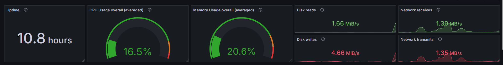
- **Shop Stats**:
  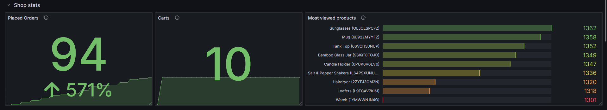
- **Node Stats**:
  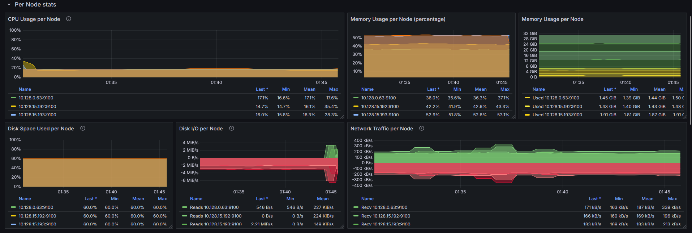
- **Pod Stats**:
  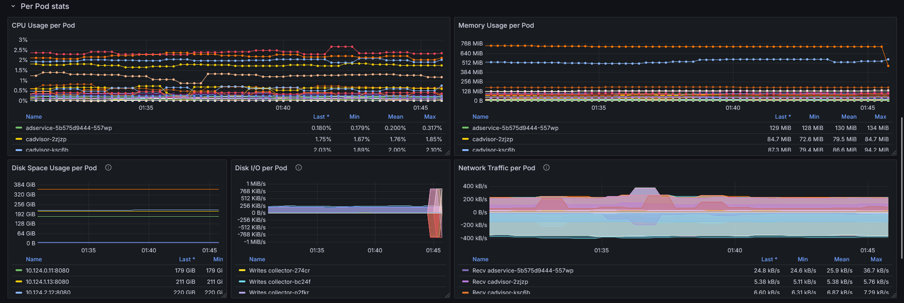
- **Redis Cart**:
  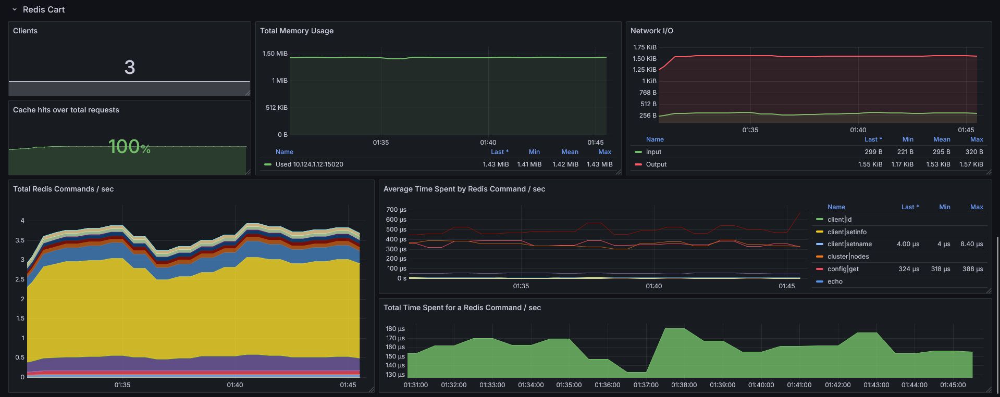

*Color schemes and visualizations were customized to enhance clarity.*

*The dashboard was inspired by existing templates and tailored to the specific requirements of the Online Boutique application. Such as the [Node Exporter](https://grafana.com/grafana/dashboards/1860), [cAdvisor](https://grafana.com/grafana/dashboards/13946), and [Redis](https://grafana.com/grafana/dashboards/763) dashboards.*

## Performance Evaluation

Performance evaluation was conducted using **Locust** to generate traffic and monitor application behavior under different load conditions.
All the necessary tecnologies were already deployed in the previous steps, so we just needed to adapt the code in `auto-deploy-loadgenerator` folder to run the tests with different configurations and on multiple machines.
This code is in the `performance-evaluation` folder.

### Methodology

- **Load Generators**:
  - The default load generator deployed with the *`microservices-demo`* application (10 users) was still active during all tests.
  - Additional load generators were deployed for scaling experiments.

- **Test Configurations**:
  - **Infrastructure**:
    - Single VM (`f1-micro`)
    - Three VMs (`f1-micro`)
    - Three VMs (`f1-micro`) + local PC
  - **VM Configuration**:
    - Used `boot_disk.initialize_params.image="debian-cloud/debian-12"` since Docker was not needed, but a package manager was useful.
  - **Traffic Patterns**:
    - User quantities: 10, 100, 1000
    - `spawn_rate`: Set to 10% of total users
    - Duration: 3 minutes

### Execution

Locust was executed with the following parameters:

```bash
locust -f locustfile.py --headless --host http://<FRONTEND_ADDR> --users <USERS> --spawn-rate <SPAWN_RATE> --csv <CSV_NAME> --run-time <RUN_TIME>
```

#### Distributed Load Testing

**First Approach** (used in the 3VMs + local pc configuration):
Used [locust-swarm](https://github.com/SvenskaSpel/locust-swarm) for distributed load testing.
Command:

```bash
swarm -f microservices-demo/src/loadgenerator/locustfile.py --loadgen-list <LOADGEN_LIST> --host http://<FRONTEND_ADDR> --run-time <RUN_TIME> --users <USERS> --spawn-rate <SPAWN_RATE> --csv <CSV_NAME>
```

With `LOADGEN_LIST` the comma-separated list of IP addresses of the deployed VMs (collected in the `loadgenerator_ips` created by the Terraform script).
This method automated the Locust master-slave architecture implementing a true distributed load testing. The master is the local PC.

**Second Approach** (used in the 3VMs configuration):
Used Ansible to deploy and manage Locust instances on three VMs parallely and then collecting data together.
Command:

```bash
ansible-playbook -i ./performance-evaluation/hosts ./performance-evaluation/setup_locust.yml --extra-vars "frontend_external_ip=$(kubectl get svc istio-ingressgateway -n istio-system -o jsonpath='{.status.loadBalancer.ingress[0].ip}') users=<USERS> spawn_rate=<SPAWN_RATE> csv_name=<CSV_NAME>"
```

Two approaches for distributed load testing were used since the first one had a really high request failure rate, so we decided to try another one to see if the problem was in the tool; in the end the problem was not in the tool.

#### Results Analysis

The results were monitored and collected via Locust's CSV output files and then analyzed using a custom script (`analysis.py`) to generate performance plots.

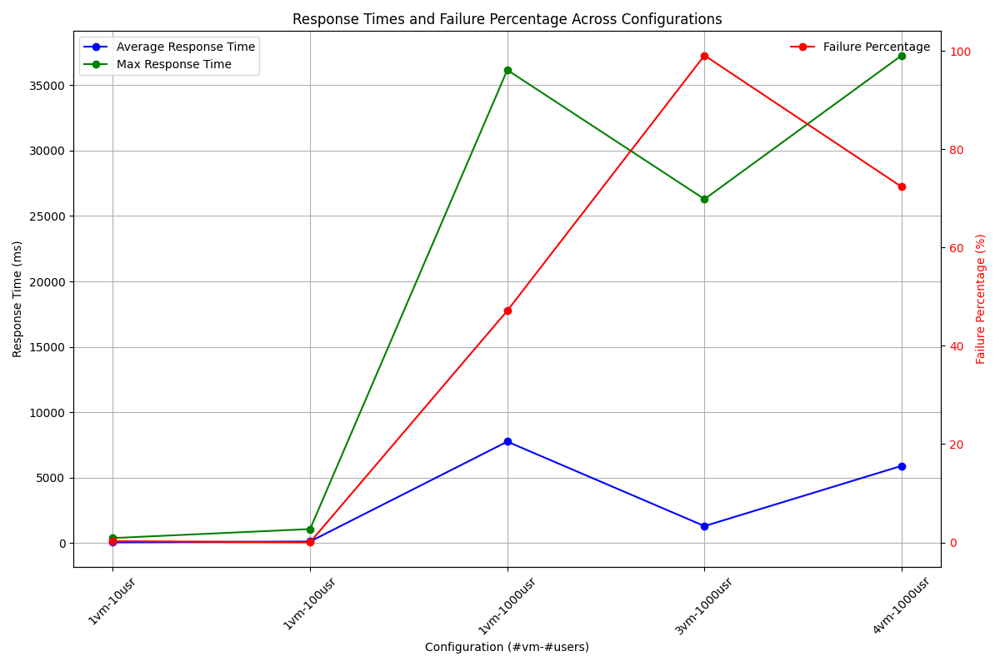

## Canary Release

We deployed a Canary Release strategy to introduce a new version of the microservice `frontend`. This strategy ensures a gradual and safe transition from the original version to a new one of the service while monitoring system performance and user experience.
The transition is performed enforcing the use of a load balancer (Istio's service mesh) to split traffic between the two versions without having disruptions in the service.

Files are in the `canary-release` folder.

### Mandatory Part

#### v2 Docker Image

We created a new Docker image: `albertopasqualetto/oba-frontend:v2` with only a small change: an additional endpoint `/v2.txt` to differentiate between versions.
In the folder there is the `frontend-v2.Dockerfile` used to build the image, the differentiation is applied through oneline sed command which adds the endpoint to the router of the `main.go` file.

```Dockerfile
RUN sed -i '/r := mux.NewRouter()/a\\tr.HandleFunc(baseUrl + "/v2.txt", func(w http.ResponseWriter, _ *http.Request) { fmt.Fprint(w, "THIS IS VERSION v2") })' main.go
```

Some other modifications were made to the original Dockerfile in order to simplify the process of building the image.

#### Istio Configuration

Canary releases were implemented using Istio's traffic management features, so some additional configurations were required.

1. **Install Istio**:
   1. Installed Istio with the default profile:

      ```bash
      istioctl manifest install --set profile=default
      ```

   2. Enabled sidecar injection for all pods in the `default` namespace (not necessary since we are focusing on the frontend microservice, but done for simplicity):

      ```bash
      kubectl label namespace default istio-injection=enabled
      ```

2. **Istio configurations**:
   Canary releases drove the usage of Istio service mesh for entire lifetime of the application, so the `istio` folder contains the necessary configurations for the frontend service and its `Konfiguration` is always applied when applying the main deployment.

   - **Gateway**: creates a new gateway for the frontend service exposing the requested port (80).
   - **VirtualService**: defines the routing rules for the frontend service.
   - **DestinationRule**: defines subsets for the frontend service.

   In the folder there are also 2 patches that remove the LoadBalancer service for the frontend and changes the load generator pointing IP to the Istio Gateway.

   ```mermaid
   flowchart TD
     A[Gateway] --> B[VirtualService]
     B --> C[Subset: v1<br>- Weight 75%]
     B --> D[Subset: v2<br>- Weight 25%]
     C --> E[Service v1<br>- Cluster IP]
     D --> F[Service v2<br>- Cluster IP]
     E --> G[Pods<br>- Labels:<br>version: v1]
     F --> H[Pods<br>- Labels:<br>version: v2]
   ```

Now the full application can be deployed with `kubectl apply -k .` in the root directory and it will be automatically injected with the sidecar.

#### 75/25 Static Traffic Split

Here the needed configurations are in the `static-split` folder.

- The static split requires labeling `v1` and `v2` versions correctly in the Deployment configuration of the 2 services.
  The original version is annotated with `version: v1` and a the new *v2* version is deployed:

  ```bash
  kubectl patch deployment frontend --type=json -p='[
    {
      "op": "add",
      "path": "/spec/template/metadata/labels/version",
      "value": "v1"
    }
  ]'

  kubectl apply -f canary-version/static-split/frontend-v2.yaml
  ```

- DestinationRule and VirtualService configurations need to be patched to reflect the new labels and relative subsets:

  ```bash
  kubectl patch destinationrule frontend --type=json -p='[
    {
      "op": "replace",
      "path": "/spec",
      "value": {
        "host": "frontend",
        "subsets": [
          {
            "name": "v1",
            "labels": {
              "version": "v1"
            }
          },
          {
            "name": "v2",
            "labels": {
              "version": "v2"
            }
          }
        ]
      }
    }
  ]'

  kubectl patch virtualservice frontend --type=json -p='[
    {
      "op": "replace",
      "path": "/spec/http/0",
      "value": {
        "route": [
          {
            "destination": {
              "host": "frontend",
              "subset": "v1"
            },
            "weight": 75
          },
          {
            "destination": {
              "host": "frontend",
              "subset": "v2"
            },
            "weight": 25
          }
        ]
      }
    }
  ]'
  ```

  Note that split ratio (in our case 75% for v1 and 25% for v2) is defined in the `weight` field of the `route` in the `VirtualService`.

*The configuration above can be applied using `cat .\canary-version\static-split\deploy.run | pwsh -` or the equivalent command for the shell you are using.*

- Deployed a static 75/25 split for the `frontend` service using the following command:

  ```bash
  cat ./canary-version/static-split/deploy.run | pwsh -
  ```

##### Generating Traffic

We used Locust toghether with a simple locustfile.py to generate traffic and test the Canary Release deployment split effectiveness.

`Locustfile`:

```python
from locust import HttpUser, task, between

class FrontendUser(HttpUser):
    host = "http://34.27.165.38"
    wait_time = between(1, 5)

    @task
    def index(self):
        self.client.get("/")

    @task(2)
    def product_page(self):
        self.client.get("/product/OLJCESPC7Z")
```

**Using Locust Interface:**

In the Locust interface, we set the number of users to generate requests per second and monitored the system’s performance.

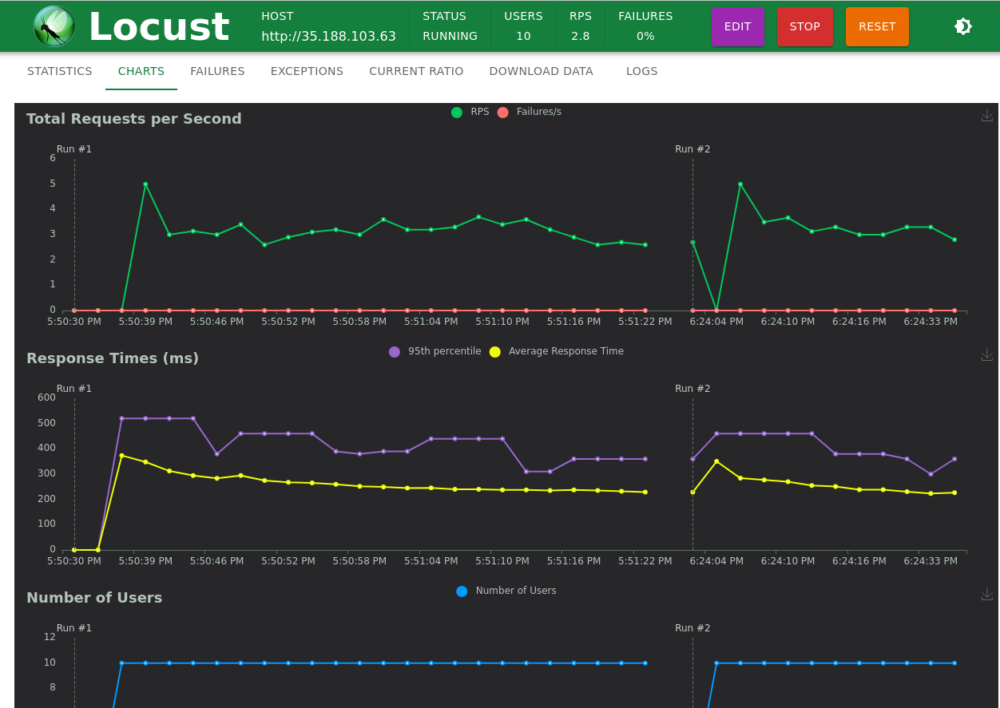

###### Verifying with Prometheus and Grafana

We analyzed traffic and performance metrics using Prometheus queries and Grafana dashboards.

Traffic was generated and delivered correctly, as shown in the Locust interface:

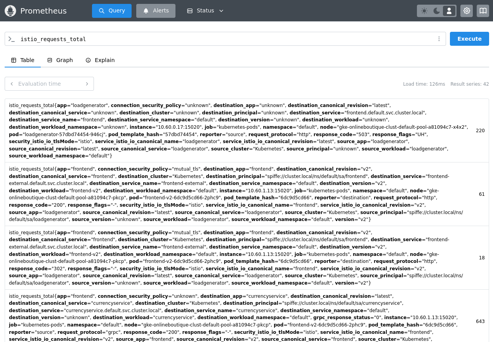

PromQL Query `sum(istio_requests_total) by (destination_workload)` showed the expected traffic distribution:

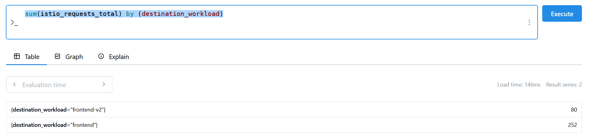

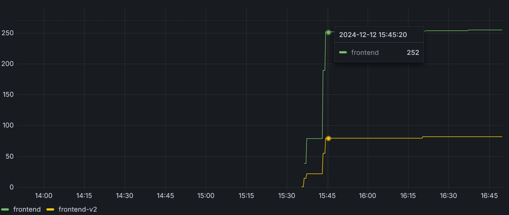

#### Automating the Canary Release with Flagger

Flagger manages automatically the canary release process, ensuring a smooth transition based on defined metrics and thresholds.
When the rollout is managed by Flagger:

- The canary version is progressively deployed to an increasing percentage of requests.
- If no traffic is detected, the canary deployment is paused until requests are received. Since the loadbalancer has been patched to send requests to Istio gateway, the canary deployment can progress smoothly. If there was no traffic, some artificial one could be generated using a `load-test` webhook in the Canary resource configuration.

##### Flagger Configuration

To set up Flagger for canary releases, the following steps were followed:

1. Applied Prometheus configuration from Istio's addon samples:

   ```bash
   kubectl apply -f https://raw.githubusercontent.com/istio/istio/release-1.24/samples/addons/prometheus.yaml
   ```

   This was chosen instead of our custom monitoring setup because it is easier to integrate with Istio and Flagger since they are already configurated to work with this implementation.
2. Installed Flagger with Istio support:

   ```bash
   kubectl apply -k github.com/fluxcd/flagger/kustomize/istio
   ```

3. Configured Flagger Canary for the `frontend` service:

   ```bash
   kubectl apply -f ./canary-version/flagger-canary.yaml
   ```

   After this step, the `frontend-primary` pod is created, and the old `frontend` pod is deleted. The following command waits for the deletion of the old pod:

   ```bash
   kubectl wait --for=delete pod -l app=frontend --timeout=300s
   ```

   After this point we are ready to use Flagger.

4. Triggered the canary deployment changing the frontend service deployment, in our case we change the image in order to test changes:

   ```bash
   kubectl set image deployment/frontend server=albertopasqualetto/oba-frontend:v2
   ```

- **Flagger Canary Configuration:**

Here is the configuration used for the `frontend` service canary deployment, it selects the deployment to be canaried and defines the analysis metrics and thresholds:

  ```yaml
  apiVersion: flagger.app/v1beta1
  kind: Canary
  metadata:
    name: frontend
    namespace: default
  spec:
    provider: istio
    targetRef:
      apiVersion: apps/v1
      kind: Deployment
      name: frontend
    progressDeadlineSeconds: 60
    service:
      port: 80
      targetPort: 8080  # container port number
      gateways:
      - frontend-gateway
      hosts:
      - "*"
    analysis:
      interval: 1m
      threshold: 10
      maxWeight: 50
      stepWeight: 10
      metrics:
      - name: request-success-rate
        thresholdRange:
          min: 99
        interval: 1m
      - name: request-duration
        thresholdRange:
          max: 500
        interval: 30s
  ```

##### Progress Monitoring

To monitor the canary deployment's progress, use:

```bash
kubectl describe canary/frontend
```

Example output of successful canary deployment:

```text
New revision detected frontend.default
Scaling up frontend.default
Waiting for frontend.default rollout to finish: 0 of 1 updated replicas are available
Advance frontend.default canary weight 10
Advance frontend.default canary weight 20
Advance frontend.default canary weight 30
Advance frontend.default canary weight 40
Advance frontend.default canary weight 50
Copying frontend.default template spec to frontend-primary.default
Waiting for frontend-primary.default rollout to finish: 1 of 2 updated replicas are available
Promotion completed! Scaling down frontend.default
```

A useful dashboard visualization is Kiali, which provides a graphical representation of the service mesh and traffic flow:

```bash
kubectl apply -f https://raw.githubusercontent.com/istio/istio/refs/heads/release-1.24/samples/addons/kiali.yaml
kubectl rollout status deployment/kiali -n istio-system
istioctl dashboard kiali
```

Kiali Dashboard during the canary deployment through Flagger:

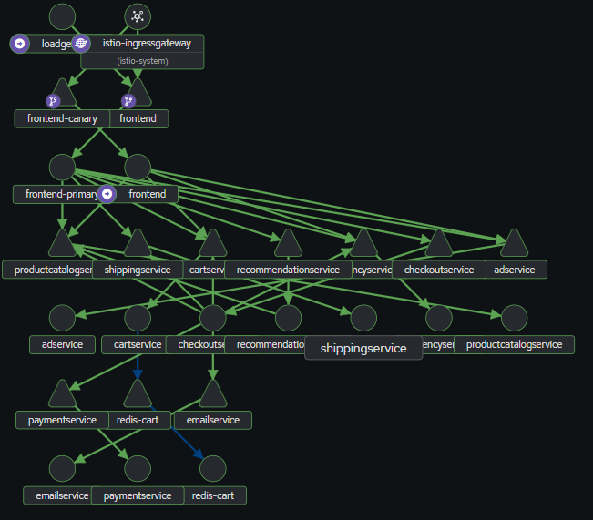

### Bonus Part: Automated Rollback of Canary Release

Using the Flagger Canary configuration described above, in particular the `analysis` section, Flagger automatically detects issues based on the defined metrics thresholds. When an issue is detected, Flagger initiates an automated rollback to the previous version.

### Rollback Process

In order to simulate a rollback, we introduced a 3s latency for all the requests in the `v3` version of the `frontend` service except for the `_healthz` endpoint used to check the service's health and liveness by Kubernetes, otherwise the service wouldn't be started correctly by Kubernetes and would result in restarts and then termination.

The relevant added line to the `main.go` file is:

```go
r.Use(func(next http.Handler) http.Handler {
  return http.HandlerFunc(func(w http.ResponseWriter, r *http.Request) {
    time.Sleep(3 * time.Second)
    next.ServeHTTP(w, r)
  })
})
```

The actual implementation can be seen in the `canary-version/frontend-v3.Dockerfile` file and is performed again using some `sed` commands

To perform rollback some metrics thresholds need to be present in the *Canary* resource configuration, this is the relvant part for us since we are interested in the request duration:

```yaml
    analysis:
      interval: 1m
      threshold: 10
      metrics:
        - name: request-duration
          threshold: 500
```

It says that when the request duration exceeds 500ms (in the v3 version it happens) for 10 times (probes are requested every 1 minute), the rollback is triggered.

The trigger of canary deployment is as before with the command `kubectl set image deployment/frontend server=albertopasqualetto/oba-frontend:v3`.

This is an output of the `kubectl describe canary/frontend` command:

```text
Normal   Synced  13m                   flagger  New revision detected! Scaling up frontend.default
Normal   Synced  12m                   flagger  Starting canary analysis for frontend.default
Normal   Synced  12m                   flagger  Advance frontend.default canary weight 10
Warning  Synced  2m52s (x10 over 11m)  flagger  Halt frontend.default advancement request duration 4.975s > 500ms
Warning  Synced  112s                  flagger  Rolling back frontend.default failed checks threshold reached 10
Warning  Synced  112s                  flagger  Canary failed! Scaling down frontend.default
```

From the output it can be seen that the deployment was rolled back because the request duration exceeded the threshold for 10 minutes.

## Review of recent publications: "Load is not what you should balance: Introducing Prequal"

### Prequal

This paper presents **Prequal**, a load balancer for distributed multi-tenant systems aimed at minimizing real-time request latency. Unlike traditional systems that focus on equalizing CPU utilization across servers, Prequal uses **Requests-In-Flight (RIF)** and **latency** as its primary metrics to dynamically assign workloads. Prequal applies the **Power of d Choices paradigm (PodC)** to optimize server selection.

#### Innovations

1. Combines **RIF** and **latency** using the **hot-cold lexicographic rule (HCL)**.
2. Introduces a novel **asynchronous probing mechanism**, which reduces overhead while maintaining fresh probing signals.

#### Deployment Success

Prequal has been successfully deployed in real-world systems such as **YouTube**, achieving significant reductions in:

- Tail latency.
- Resource utilization.

### Weighted Round Robin (WRR)

The authors explore the operational environment of large-scale services like **YouTube**, comprising a network of jobs issuing millions of queries to distributed replicas.
They show that traditional load balancers like **Weighted Round Robin (WRR)** are insufficient for such systems, as they fail to account for the complexities of distributed systems and Prequal is proposed as a solution.

#### How WRR Works

**Weighted Round Robin (WRR)** uses smoothed historical statistics for each replica to periodically compute weights. These include:

- **Goodput** (successful query rate).
- **CPU utilization**.
- **Error rate**.

The weight for each replica, \( w_i \), is calculated as:

\[
w_i = \frac{q_i}{u_i}
\]

Where:

- \( q_i \): Queries per second (QPS) for replica \( i \).
- \( u_i \): CPU utilization of replica \( i \).

#### Limitation of WRR

While WRR performs well if all replicas stay within their CPU allocations, overload is common and occurs even at small timescales. In such cases, WRR fails to handle the complexities of distributed systems, particularly under high-load spikes, leading to:

- Increased tail latencies.
- Service-level objective (SLO) violations.

### System Design

Prequal dynamically adjusts load balancing by combining two key signals:

1. **Requests-In-Flight (RIF)**.
2. **Latency**.

#### Probing Rate

Prequal issues a specified number of probes (\( r_{\text{probe}} \)) triggered by each query. More probes may be issued after a maximum idle time. The **probing rate** is linked to the **query rate**, ensuring up-to-date information while minimizing redundant probes.

Probing targets are sampled randomly from available replicas to avoid the **thundering herd phenomenon**, where multiple clients inundate a single replica with low latency, leading to queuing and increased delays.

#### Load Signals

When responding to a probe:

- **RIF**: Checked from the counter, providing an instantaneous signal.
- **Latency**: Estimated from recently completed queries. The median latency for recent queries with similar RIF values is returned.

#### Probe Pool

Prequal maintains a **probe pool** containing responses for selecting replicas. Key features:

- Maximum size is capped (e.g., 16, as this proved optimal).
- Probes are replaced based on age and relevance to ensure freshness.

#### Replica Selection

Prequal uses the **Hot-Cold Lexicographic (HCL) Rule**:

- **Hot** replicas: RIF exceeds a quantile threshold \( Q_{\text{RIF}} \).
- **Cold** replicas: RIF below \( Q_{\text{RIF}} \).

**Selection logic**:

1. If all replicas are hot, select the one with the lowest RIF.
2. If at least one is cold, select the cold replica with the lowest latency.
3. If the pool is empty, fallback to a random selection.

This approach balances load effectively while minimizing latency.

### Error Handling

#### Sinkholing Prevention

A problematic replica may process queries quickly by returning errors, making it seem less loaded. This behavior, known as **sinkholing**, can attract more traffic, exacerbating issues. Prequal avoids this using heuristic-based safeguards.

### Performance Comparison

#### Observed Improvements

Prequal consistently outperformed WRR in both real-world deployments (e.g., YouTube) and test environments:

- **2x reduction** in tail latency and CPU utilization.
- **5–10x reduction** in tail RIF.
- **10–20% reduction** in memory usage.
- Near-elimination of errors due to load imbalances.

#### Robustness

Prequal proved beneficial regardless of whether other services in the network used it. It works efficiently across diverse job types and query processing requirements (e.g., CPU, RAM, latency).

### Key Innovations of Prequal

1. **Asynchronous Probing**: Ensures real-time updates without impacting query processing.
2. **Hot-Cold Lexicographic Rule**: Balances the trade-off between load and latency.
3. **Error Aversion**: Safeguards against issues like sinkholing.
4. **Optimized Resource Usage**: Reduces tail latencies and overhead while enabling higher utilization.

### Canary Release and load balancer

The load balancer is stright related to the Canary Release that we had to build during the project.

A canary release is a deployment strategy where a new version of an application or service is gradually rolled out to a subset of users before a full-scale release.

In our example, we introduced a new version of the frontend service. Initially, we configured the load balancer with static weights to gradually route traffic between versions. Later, we automated this process using Flagger.

We monitored the results through the load balancer, which allowed us to collect metrics for comparison. In the event of errors or degraded performance, the load balancer facilitated an automatic rollback to ensure system stability.

The load balancer is central to implementing a canary release:

- The load balancer splits incoming traffic between the existing version and the new version  of the application.
  - For example in our case, 75% of traffic might go to the stable version (V1), while 25% is routed to the new version (V2) of the frontend.

- The load balancer allows you to monitor the performance of the new version in real-time by isolating the subset of traffic it handles.
If issues are detected in the canary deployment, the load balancer can instantly stop routing traffic to the new version, reverting all traffic to the stable version.

- As confidence in the new version grows, the load balancer can progressively increase the proportion of traffic routed to the canary version until it eventually serves 100% of the traffic. As we did with Flugger in our example.

More specifically in our approach Istio's Ingress Gateway was used as a load balancer to route traffic between the two versions of the frontend service. The Istio Gateway and VirtualService resources were configured to split traffic between the two versions declared in DestinationRule resources based on the weight assigned to each; Flagger operates automatically generating the cited resources.

#### Future Works taking inspiration from Prequal

Prequal system may be implemented in the load balancer which selects which release (primary or canary) to distribute at each request, but since the release of a canary version is rare, the improvements could not be so noticeable.

Instead, Prequal dynamics can be implemented with more effectiveness in the load balancing system used to manage more pods hosting the same microservice version managed by HorizonalPodAutoscaler in Kubernetes.

##### Leveraging Prequal for Autoscaling in Kubernetes

Traditional Kubernetes autoscaling relies on metrics such as CPU and memory utilization. However, these metrics may not capture key load signals for applications that must respond to real-time traffic spikes. By utilizing signals provided by Prequal, such as Requests-in-Flight (RIF) and estimated latency, we can design a more responsive and optimized auto scaling system tailored for the project.

###### Development Plan

1. Prometheus Configuration:
        Set up Prometheus to collect Prequal signals such as the number of Requests-in-Flight and estimated latency.

2. Horizontal Pod Autoscaler (HPA):
        Configure the HPA to respond to custom metrics based on Prequal signals.

3. Load Variation Monitoring:
        Observe how the HPA responds to changes in load and traffic patterns.

4. Performance Analysis:
        Evaluate the effectiveness of the implementation and identify potential improvements.
