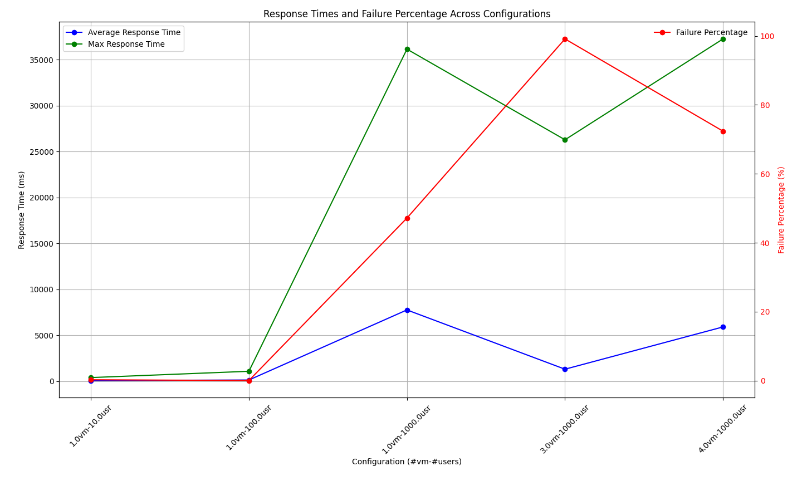

# The Report

Every command is to be run from the root of the repository.

## Deploying the original application in GKE

We created the cluster from GKE dashboard, choosing the standard configuration (zone, cluster name, node count ...).

Then we cloned the repository;
 and we connected to the cluster with `gcloud container clusters get-credentials onlineboutique`

`kubectl apply -f ./release/kubernetes-manifests.yaml`

We verified the deployment was succesfull obtaining the ip address of the frontends load balancer with `kubectl get services frontend-external` and throw output of the load generator with `kubectl logs <LOADGENERATOR_POD_NAME>`.

Explain the Autopilot mode.

## Analyzing the provided configuration

# Autopilot

**Autopilot** is a GKE operation mode where Google manages the cluster configuration, including:
- Nodes
- Scaling
- Security

According to the [Autopilot vs Standard Feature Comparison](https://cloud.google.com/kubernetes-engine/docs/resources/autopilot-standard-feature-comparison):
- Autopilot **manages nodes**.
- Autopilot **automatically scales the number and size of nodes** based on Pods in the cluster.
- Autopilot uses a **general-purpose platform optimized for most workloads**.

This hides cluster configuration details from the user, addressing issues like low resource allocation often seen in GKE's standard mode.

---

# Configuration Explanation

The `kubernetes-manifests.yaml` file defines configurations for all Online Boutique services. For each service, it includes:
- A **`Deployment`**
- One or more **`Service`** objects
- A **`ServiceAccount`**

### Frontend Service Example

Here is an example configuration for the **frontend service**:

```yaml
---
apiVersion: apps/v1
kind: Deployment
metadata:
  name: frontend
  labels:
    app: frontend
spec:
  selector:
    matchLabels:
      app: frontend
  template:
    metadata:
      labels:
        app: frontend
      annotations:
        sidecar.istio.io/rewriteAppHTTPProbers: "true"
    spec:
      serviceAccountName: frontend
      securityContext:
        fsGroup: 1000
        runAsGroup: 1000
        runAsNonRoot: true
        runAsUser: 1000
      containers:
      - name: server
        securityContext:
          allowPrivilegeEscalation: false
          capabilities:
            drop:
              - ALL
          privileged: false
          readOnlyRootFilesystem: true
        image: gcr.io/google-samples/microservices-demo/frontend:v0.10.1
        ports:
        - containerPort: 8080
        readinessProbe:
          initialDelaySeconds: 10
          httpGet:
            path: "/_healthz"
            port: 8080
            httpHeaders:
            - name: "Cookie"
              value: "shop_session-id=x-readiness-probe"
        livenessProbe:
          initialDelaySeconds: 10
          httpGet:
            path: "/_healthz"
            port: 8080
            httpHeaders:
            - name: "Cookie"
              value: "shop_session-id=x-liveness-probe"
        env:
        - name: PORT
          value: "8080"
        resources:
          requests:
            cpu: 100m
            memory: 64Mi
          limits:
            cpu: 200m
            memory: 128Mi
---
apiVersion: v1
kind: Service
metadata:
  name: frontend
  labels:
    app: frontend
spec:
  type: ClusterIP
  selector:
    app: frontend
  ports:
  - name: http
    port: 80
    targetPort: 8080
---
apiVersion: v1
kind: Service
metadata:
  name: frontend-external
  labels:
    app: frontend
spec:
  type: LoadBalancer
  selector:
    app: frontend
  ports:
  - name: http
    port: 80
    targetPort: 8080
---
apiVersion: v1
kind: ServiceAccount
metadata:
  name: frontend
---
```

---

## Explanation of Key Fields

### Common Fields
- **`apiVersion`**: The API version for the object.
- **`kind`**: The type of Kubernetes object (e.g., `Deployment`, `Service`, `ServiceAccount`).
- **`metadata`**: Contains the object's name and labels.

---

### Deployment Specification
- **`selector.matchLabels.app: frontend`**: Matches pods managed by this deployment.
- **`template`**:
  - **`metadata.labels.app: frontend`**: Labels the pods for this deployment.
  - **`annotations.sidecar.istio.io/rewriteAppHTTPProbers: "true"`**: Ensures Istio rewrites readiness and liveness probes.
  - **`spec.serviceAccountName: frontend`**: Associates the deployment with the `frontend` ServiceAccount.
  - **`securityContext`**: Configures security settings for the pod:
    - **`fsGroup`, `runAsGroup`, `runAsUser`**: Ensures non-root execution with specific user/group IDs.
    - **`runAsNonRoot: true`**: Enforces that the container runs as a non-root user.
  - **`containers`**:
    - **`securityContext`**: Hardens container security:
      - **`allowPrivilegeEscalation: false`**: Prevents privilege escalation.
      - **`capabilities.drop: [ALL]`**: Drops all POSIX capabilities.
      - **`privileged: false`**: Runs the container in a non-privileged mode.
      - **`readOnlyRootFilesystem: true`**: Makes the filesystem read-only.
    - **`image`**: Specifies the container image to use.
    - **`ports.containerPort: 8080`**: Exposes port 8080 inside the pod.
    - **`readinessProbe`**: Configures readiness checks:
      - HTTP GET request to `/_healthz` on port 8080.
    - **`livenessProbe`**: Configures liveness checks:
      - Similar to readiness checks but for container health.
    - **`resources`**: Defines resource requests and limits:
      - CPU: `100m` (min), `200m` (max).
      - Memory: `64Mi` (min), `128Mi` (max).

---

### Service Specifications
1. **Frontend Service (`ClusterIP`)**:
   - **`type: ClusterIP`**: Exposes the service within the cluster.
   - **`selector.app: frontend`**: Routes traffic to pods with matching labels.
   - **`ports`**: Maps external port 80 to internal port 8080.

2. **Frontend External Service (`LoadBalancer`)**:
   - **`type: LoadBalancer`**: Exposes the service externally with a public IP.
   - **`selector.app: frontend`**: Routes traffic to pods with matching labels.
   - **`ports`**: Maps external port 80 to internal port 8080.

---

### ServiceAccount
- A **`ServiceAccount`** represents a non-human Kubernetes user, providing a distinct identity for interactions.

## Deploying the load generator on a local machine

We used the image of the load generator provided by the original repository (`us-central1-docker.pkg.dev/google-samples/microservices-demo/loadgenerator:v0.10.2`) and we ran it with the command `docker run -e FRONTEND_ADDR=<ADDRESS> -e USERS=10 <IMAGE ID>` and we analyzed the output and we understood it was accesible outside.

## Deploying automatically the load generator in Google Cloud

- We took from "Running MPI applications" the Terraform-related files (`simple_deployment.tf`, `variables.tf`, `parse-tf-state.py`, `setup.sh`) and we modified them to run an image with docker engine installed (`boot_disk.initialize_params.image="cos-cloud/cos-117-lts"`) within our GCP project and then we ran with `terraform -chdir=auto-deploy-loadgenerator init`.
- To run it, `GCPUserID` and `GCPPrivateSSHKeyFile` variables are needed (set in `terraform.tfvars`).
- Everything is setup by Terraform (hosts inventory file also)
- `terraform -chdir="auto-deploy-loadgenerator" plan -var-file="../terraform.tfvars"`
- `terraform -chdir="auto-deploy-loadgenerator" apply -var-file="../terraform.tfvars"`

- We created the Ansible playbook `run_docker_image.yml` to run the Locust loadgenerator.
- `ansible-playbook -i ./auto-deploy-loadgenerator/hosts ./auto-deploy-loadgenerator/run_docker_image.yml --extra-vars "frontend_external_ip=$(kubectl get svc istio-ingressgateway -n istio-system -o jsonpath='{.status.loadBalancer.ingress[0].ip}')"`
  - `hosts` file is generated by Terraform using the "local_file" resource.
- Ansible does not work from Windows so we used wsl to use it in a linux enviroment.

# Monitoring the application and the infrastructure

## Mandatory part

Monitoring the application and its supporting infrastructure is essential for understanding system behavior, identifying bottlenecks, and detecting potential issues before they impact the end users. The following outlines the steps and tools utilized for implementing monitoring in this project.

## Implementation Overview

### Directory Structure
All related files and configurations are organized in the **`monitoring`** folder for ease of access and maintenance.

### Deployment Approach
- **Kustomize** was used to manage Kubernetes manifests without relying on Helm, aligning with the project's requirements for simplicity and flexibility so in order to deploy the monitoring infrastructure, ensure to uncomment the monitoring section in the `kustomization.yaml` file and then run `kubectl apply -k .`.

### Prometheus Setup
Prometheus was employed as the primary tool for collecting and aggregating metrics. Below are the specific configurations and components used:

#### 1. **ClusterRole**
A **ClusterRole** was configured to grant Prometheus access to metrics from all pods within the cluster. This setup posed initial challenges due to the lack of clear documentation, but the issue was resolved by thorough exploration and experimentation.

#### 2. **Exporters**
Exporters were deployed to collect resource consumption metrics at both the node and pod levels:

- **Node Exporter**:
  - Collects statistics at the **node level**, such as CPU usage, memory consumption, and disk I/O.
  - Deployed as a **DaemonSet**, ensuring that one instance runs on every node in the cluster.
  - **DaemonSet Explanation**: A Kubernetes controller that automatically ensures a pod runs on all or specific nodes, making it ideal for node-level monitoring.

- **cAdvisor**:
  - Collects statistics at the **pod level**, including CPU, memory, and container-specific metrics.
  - Also deployed as a **DaemonSet** for consistent monitoring across all nodes in the cluster.
  - **DaemonSet Explanation**: Similar to the node exporter setup, cAdvisor leverages the DaemonSet controller to provide comprehensive coverage of all pods running in the cluster.

#### 3. **Prometheus Configuration**
The **`prometheus-config.yml`** file was created to define scraping jobs for collecting metrics. This includes configurations for node-exporter and cAdvisor endpoints to ensure seamless integration.

### Grafana Integration
To visualize the metrics collected by Prometheus:
- Grafana dashboards were configured to display:
  - **Node-level metrics**, such as CPU and memory utilization.
  - **Pod-level metrics**, including resource usage per container.
- Predefined dashboards were included in the monitoring setup to provide instant insights.

---
# TODO
- Grafana
  - provisioned from file
    - /etc/grafana/provisioning/datasources <- grafana-datasources configmap 
      - configMapGenerator (!!) in kustomization.yaml
  - OBA Dashboard
    - show main metrics (cite them)
    
    
    
    
    
    
    - took inspiration from:
      - 1860 node-exporter
      - 13946 cAdvisor
      - 763 redis
    - some **PromQL** queries does not work with all ranges
    - colors etc
  - admin:admin

# Bonus: Advanced Monitoring and Alerts

## Collecting More Specific Metrics

Beyond general resource consumption metrics, we implemented additional monitoring capabilities to collect more specific metrics for certain components. Below are the enhancements:

### Redis Metrics
- **Purpose**: Redis is used for the cart functionality in the application.
- **Exporter**: We used the `oliver006/redis_exporter` to collect Redis-specific metrics.
- **Integration**:
  - The exporter was added to the cart pod using a Kubernetes patch file: `redis-exporter.patch.yaml`.
- **Visualization**: A Grafana dashboard was configured to display Redis metrics (e.g., latency, command execution rates).
- **Evidence**: Screenshot of the dashboard (included in the report).

---

### gRPC Metrics
- **Goal**: Monitor gRPC metrics for services, using the `checkoutservice` as an example.
- **Challenges**:
  - Attempted to use OpenTelemetry (otel) but faced limitations due to its incomplete integration with the existing codebase.
  - Required building familiarity with Golang as we were new to the language.
- **Implementation**:
  - Metrics for the gRPC server in the `checkoutservice` were extracted using the `github.com/grpc-ecosystem/go-grpc-middleware/providers/prometheus` library.
  - Added patches to the Kubernetes manifests for integration.
  - Built a new image: `albertopasqualetto/checkoutservice:monitoring`.
  - Configured to expose metrics using the `promhttp` package from `github.com/prometheus/client_golang/prometheus/promhttp`.
- **Metrics Example**:
  - Client-side metrics were also made available but not implemented fully.
  - Example: Tracked the number of "Placed Orders."
- **Visualization**: A Grafana dashboard visualizes gRPC metrics (e.g., request counts and latency).
- **Evidence**: Screenshot of the dashboard (included in the report).

---

### Custom Exporter
- **Purpose**: Create a custom metric for the `productcatalogservice` to track product retrievals.
- **Implementation**:
  - Developed using Golang libraries.
  - Integrated using Kubernetes patches (similar to gRPC metrics).
  - Built a new image: `albertopasqualetto/productcatalogservice:monitoring`.
  - Used the `github.com/prometheus/client_golang/promauto` library to define a custom counter metric:
    ```go
    productRetrievalCounter = promauto.NewCounterVec(
      prometheus.CounterOpts{
          Name: "product_retrieval_count",
          Help: "Counter of retrieved products by ID",
      },
      []string{"product_id", "product_name"},
    )

    [...]

    productRetrievalCounter.WithLabelValues(found.Id, found.Name).Inc()
    ```
  - Exposed metrics using the `promhttp` package.

- **Visualization**: Grafana dashboard displays metrics for product retrievals.

- In the procedure of collecting more specific metrics, we encountered some predisposition for tracing and metrics exporters in some microservices like described in [Google Cloud Operations Integration page](https://github.com/GoogleCloudPlatform/microservices-demo/tree/main/kustomize/components/google-cloud-operations), actually only the shipping service integrates a OpenTelemetry exporter, but in the end it was only a mock-up. For this reason we decided to ignore this information.

---

## Raising Alerts

### Alerting Configuration
- Alerts were provisioned directly in Grafana. Future updates may involve switching to Prometheus-based alerting for better alignment with the task description.
- Example Alerts:
  - Resource usage thresholds (e.g., high CPU or memory usage).
  - Application-specific metrics (e.g., Redis latency exceeding limits, gRPC failures).
  - Placeholder alerts fired at startup due to the absence of data.

### Notification System
- Alerts were configured to send notifications to a **Telegram bot** and channel for real-time updates.
  - [Telegram Bot](https://t.me/oba_grafana_alerts_bot)
  - [Telegram Channel](https://t.me/+GpjvzfmIGZM4NTk0)

---

This extended monitoring and alerting setup enhances visibility into the application's behavior and enables proactive management of potential issues.

## Performance evaluation
# TODO
- We used Locust to generate traffic.
- Everytime also another already deployed load generator was present (the default one) with 10 users.
- It have been monitored by the csv output.
- Different tests have been done: 1vm f1-micro, 3vm f1-micro, 3vm f1-micro + local_pc.
- VMs spawned using Terraform in a similar fashion as in the previous section regarding the automatic deployment of the load generator.
  - Now using `boot_disk.initialize_params.image="debian-cloud/debian-12"` since Docker was not needed, but a package manager was.
- Everytime the `spawn_rate` has been set to 10% of the users.
- Different user quantities have been tested: 10, 100, 1000.
- Always 3 minutes of run time.
- Command: `locust -f locustfile.py --headless --host http://<FRONTEND_ADDR> --users <USERS> --spawn-rate <SPAWN_RATE> --csv <CSV_NAME> --run-time <RUN_TIME>`
- Two approaches for distributed load generation have been tested because the first time the results were very bad, so we tried a different approach to see if it was the problem.
- For 3vm f1-micro the same command was used trough the Ansible playbook `run_locust_retireve_csv.yml` with the command `ansible-playbook -i ./performance-evaluation/hosts ./performance-evaluation/setup_locust.yml --extra-vars "frontend_external_ip=$(kubectl get svc istio-ingressgateway -n istio-system -o jsonpath='{.status.loadBalancer.ingress[0].ip}') users=<USERS> spawn_rate=<SPAWN_RATE> csv_name=<CSV_NAME>"` which installs Locust, runs it and retrieves the csv files.
- For 3vm f1-micro + local_pc [locust-swarm](https://github.com/SvenskaSpel/locust-swarm) library was used to run the tests in parallel with a similar command: `swarm -f microservices-demo/src/loadgenerator/locustfile.py --loadgen-list <LOADGEN_LIST> --host http://<FRONTEND_ADDR> --run-time <RUN_TIME> --users <USERS> --spawn-rate <SPAWN_RATE> --csv <CSV_NAME>`
  - Where `LOADGEN_LIST` is a comma-separated list of the ip addresses of the deployed VMs.
  - This is actually a real distributed load generation because it uses the locust master-slave architecture, the previous approach just managed manually multiple locust instances.
- The results have been analyzed with the `analysis.py` script to generate a plot.


## Canary Release

We deployed a Canary Release strategy to introduce a new version of the microservice `frontend`. This strategy ensures a gradual and safe transition from `v1` to `v2` of the service while monitoring system performance and user experience.

### Steps

#### Dockerfile Version

We created new Docker images (`albertopasqualetto/oba-frontend:v2`, `albertopasqualetto/oba-frontend:v3`) with small differences between each version.

#### 75/25 Traffic Split


1. **Install Istio**:
   - Installed Istio with the default profile:
     ```bash
     istioctl manifest install --set profile=default
     ```
   - Enabled sidecar injection for all pods in the `default` namespace:
     ```bash
     kubectl label namespace default istio-injection=enabled
     ```

2. **Deploy Initial Application**:
   - Deployed the initial `frontend` application with the necessary configurations for the traffic split:
     ```bash
     kubectl apply -k .
     ```

3. **Static Traffic Split Configuration**:
   - Deployed a static 75/25 split for the `frontend` service using the following command:
     ```bash
     cat ./canary-version/static-split/deploy.run | pwsh -
     ```
     - The static split requires labeling `v1` and `v2` versions correctly in the deployment configuration.

4. **Traffic Distribution**:
   - Configured Istio’s `VirtualService` and `DestinationRule` to direct 75% of the traffic to `v1` and 25% to `v2`.

#### Deploying Frontend Versions

- **Deploy Primary Frontend Version:**

  ```bash
  kubectl apply -k .
  ```

- **Deploy Frontend v2:**

  ```bash
  kubectl apply -f ./canary-version/frontend-v2
  ```

#### 6. Configuring Istio

- **Istio Gateway Configuration:**

  ```bash
  kubectl apply -f gateway.yaml
  ```

- **VirtualService Configuration:**
  
  Configured to split traffic, with 75% routed to `v1` and 25% routed to `v2` initially:

  ```bash
  kubectl apply -f ./canary-release/frontend-virtualservice.yaml
  ```

- **DestinationRule Configuration:**

  Defined subsets for `v1` and `v2` using appropriate labels:

  ```bash
  kubectl apply -f ./canary-release/frontend-destinationrule.yaml
  ```

#### 7. Generating Traffic

We used Locust to generate traffic and test the Canary Release deployment.

- **Locustfile:**

  ```python
  from locust import HttpUser, task, between

  class FrontendUser(HttpUser):
      host = "http://34.27.165.38"
      wait_time = between(1, 5)

      @task
      def index(self):
          self.client.get("/")

      @task(2)
      def product_page(self):
          self.client.get("/product/OLJCESPC7Z")
  ```

- **Using Locust Interface:**

  In the Locust interface, we set the number of users to generate requests per second and monitored the system’s performance.

  

- **Monitoring with Prometheus and Grafana:**

  We analyzed traffic and performance metrics using Prometheus queries and Grafana dashboards.
  ##### Results

- **Traffic Generation with Locust:**

  Traffic was generated correctly, as shown in the Locust interface:

  

- **Prometheus Metrics:**

  Queries showed the expected traffic distribution:

  

- **Grafana Dashboard:**

  The plotted data demonstrated the performance of both versions:

  

#### 8. Automating the Canary Release with Flagger


# Canary Releases with Flagger

## Flagger Configuration

To set up Flagger for canary releases, the following steps were followed:

1. Applied Prometheus configuration from Istio's addon samples:
   ```bash
   kubectl apply -f https://raw.githubusercontent.com/istio/istio/release-1.24/samples/addons/prometheus.yaml
   ```
   This was chosen instead of the custom monitoring setup because it is easier to use and already includes the necessary configurations for integration with Flagger.

2. Installed Flagger with Istio support:
   ```bash
   kubectl apply -k github.com/fluxcd/flagger/kustomize/istio
   ```

3. Configured Flagger Canary for the `frontend` service:
   ```bash
   kubectl apply -f ./canary-version/flagger-canary.yaml
   ```
   After this step, the `frontend-primary` pod is created, and the old `frontend` pod is deleted. The following command ensures the deletion of the old pod:
   ```bash
   kubectl wait --for=delete pod -l app=frontend --timeout=300s
   ```

4. Triggered the canary deployment:
   ```bash
   kubectl set image deployment/frontend server=albertopasqualetto/oba-frontend:v2
   ```
   - The new version (`v2`) of the `frontend` includes an additional endpoint `/v2.txt` to distinguish between versions.
   - The corresponding Dockerfile is located in the `canary` folder.

---

## Progress Monitoring

To monitor the canary deployment's progress, use:
```bash
kubectl describe canary/frontend
```

### Additional Visualization
- A useful dashboard for Istio and Flagger:
  ```bash
  kubectl apply -f https://raw.githubusercontent.com/istio/istio/refs/heads/release-1.24/samples/addons/kiali.yaml
  kubectl rollout status deployment/kiali -n istio-system
  istioctl dashboard kiali
  ```

---

## Behavior of Automatic Rollouts with Flagger

When the rollout is managed by Flagger:
- The canary version is progressively deployed to an increasing percentage of requests.
- If no traffic is detected, the canary deployment is paused until requests are received.

---

This setup ensures smooth and controlled canary releases while providing real-time monitoring and progress tracking through Flagger and Istio dashboards.

- **Flagger Canary Configuration:**

  ```yaml
  apiVersion: flagger.app/v1beta1
  kind: Canary
  metadata:
    name: frontend
    namespace: default
  spec:
    provider: istio
    targetRef:
      apiVersion: apps/v1
      kind: Deployment
      name: frontend
    service:
      port: 80
      hosts:
        - "*"
    analysis:
      interval: 1m
      threshold: 5
      maxWeight: 50
      stepWeight: 10
      metrics:
        - name: request-success-rate
          threshold: 99
        - name: request-duration
          threshold: 500
  ```

